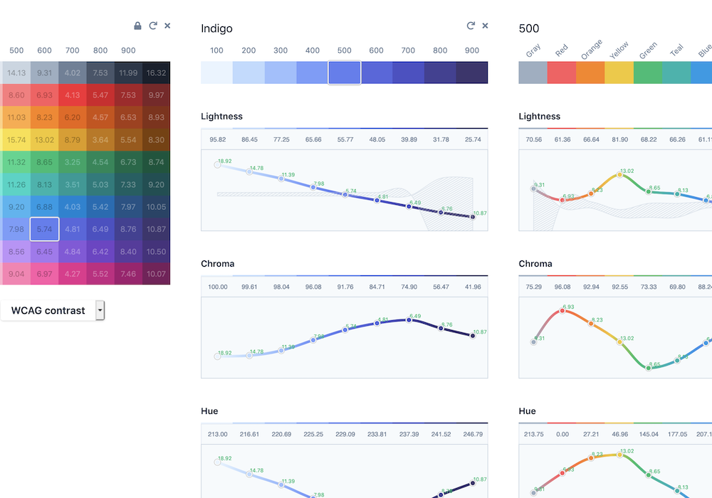

# WCAG-Ratio Tool
*aka a very quick, scrappy, futile attempt to copy Stripe's excellent developers*

[WIP Demo](https://wcag-ratio-stripe-tool.vulkd.now.sh).

Attempts to display clearly-defined areas on H/S/L charts where accessibility guidelines ([WCAG 2.1](https://www.w3.org/TR/WCAG21/)) would be broken.

Based off of [https://stripe.com/au/blog/accessible-color-systems](https://stripe.com/au/blog/accessible-color-systems).

Still pretty new to D3 - Stripe's doing some funky function stuff with their charts which I can't quite figure out yet.

They've said there are no plans to open source their tool atm, though they might - which I'm sure a lot of people are keen to have a look at!

